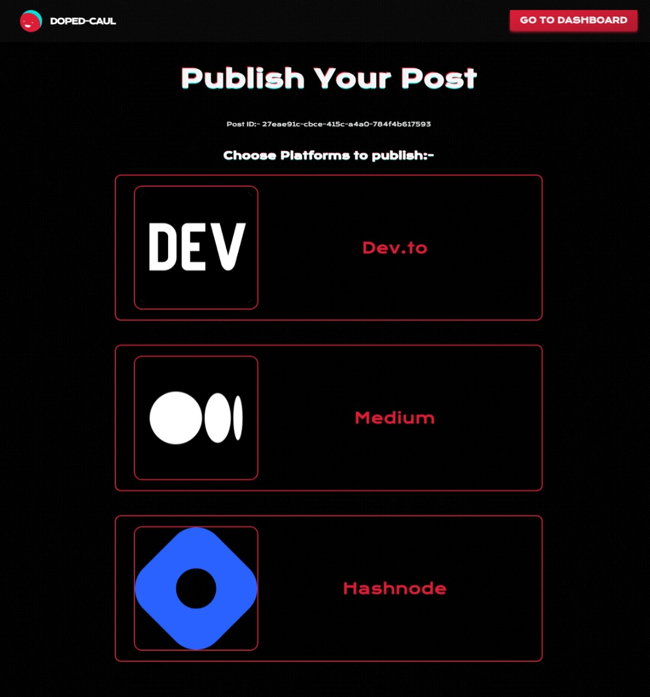

# 🖋️ Doped-Caul 🖋️

<p align="center">
<h2 align="center">Markdown -> AI -> Publish</h2>
<br />

</p>

> [!NOTE]
>
> Doped Caul" is a cutting-edge platform that combines the expertise of human writers with the capabilities of artificial intelligence. It allows technical writers to create and publish their articles efficiently, with the help of an AI assistant that can automatically enhance and complete your work. The platform boasts a user-friendly interface, a safe and secure environment with GitHub OAuth login, and a streamlined publishing process, eliminating the hassle of managing multiple platforms.

---

## ✨ Features

- **AI-Powered Writing Assistant** 🧠: Leverage the power of AI to enhance and streamline your writing process. Get real-time suggestions and assistance from advanced language models.

- **Seamless Integration with Popular Platforms** 🌐: Publish your AI-written articles directly to platforms like dev.to, Medium, and Hashnode with just a few clicks. No more hassle of managing multiple platforms.

- **Secure and User-Friendly Interface** 🔒💻: Enjoy a safe and secure environment with GitHub OAuth login. The intuitive UI ensures a smooth writing experience for technical writers.

- **Customizable Prompts** 🎨: Tailor the AI prompts to your specific needs, ensuring that the generated content aligns with your writing style and preferences.

- **Markdown Support** 📝: Write in Markdown format and get a live preview of your content rendered in HTML, making it easy to visualize the final output.

- **Real-Time Collaboration** 🤝: Invite your team members or co-authors to collaborate on articles in real-time, streamlining the writing and editing process.

- **Version Control** 📁: Track changes and revert to previous versions of your articles, ensuring you never lose your work.

- **Responsive Design** 📱💻: Access and write from anywhere, with a mobile-friendly interface that adapts to various screen sizes.

- **Robust Backend** 🛠️: Built with Express.js and powered by OpenAI's GPT-3.5 model, ensuring reliable and high-quality AI-generated content.

## 💻 Tech Stack

**Frontend:**
- React
- Refine (React-based framework)
- UnoCSS (Utility-first CSS framework)
- CopilotKit (AI integration)

**Backend:**
- Node.js
- Express.js
- OpenAI API (GPT-3.5 model)

**Authentication and Database:**
- Supabase (Authentication and Database solution)

**Other Libraries and Tools:**
- marked (Markdown to HTML converter)
- React Memo (Performance optimization)
- GitHub OAuth (Secure authentication)

## 🖼️ Screenshots

> Here's a working and expected screenshot of Tila dashboard


| Landing Page  |
|------------|
|  |


| Dashboard  |
|------------|
|  |


| New Post |
|------------|
|  |


| Edit Post |
|------------|
|  |


| Publish Post |
|------------|
|  |

| Markdown Editor |
|------------|
|  |

| Supabase `posts` table fields |
|------------|
|  |


---

# 🚀 Self-Hosting

> [!TIP]
>
> Tila Dashboard is designed to be easily self-hosted. Follow these steps to set
> up your own instance:

1. **Clone or Use as Template**: Start by either cloning the Tila Dashboard repository directly or use it as a template to create a new repository for your own customized version.

2. **Clear Demo Data**: Before you begin configuring the project, run the command **` deno run -A scripts/delete_data.js `** to clear the demo data from the repository, ensuring a clean slate for your own website monitoring setup.

3. **Configure Uptime Workflow**: Navigate to the **`.github/workflows/uptimer.yml`** file and update it with your website's domain and the desired monitoring schedule in crone date time format. This will set up a recurring GitHub Actions workflow to regularly check the uptime of your website.

4. **Add Your Website Domain**: Either add your website's domain to the `CONFIG.json` file or specify it under the **`WEBSITE_DOMAIN`** environment variable in the **`.github/workflows/uptimer.yml`** workflow. This will ensure that the dashboard tracks the correct website.

5. **Verify Settings**: Run the command **` deno run -A scripts/get_data.js `** to check that your website domain and other settings are correctly configured.

6. **Set Up Browserless Credentials**: Configure the `BROWSERLESS_SERVER_DOMAIN` GitHub repository secret for the Browserless API and authentication `TOKEN`. This will allow the uptime monitoring workflow to securely access the Browserless service.

7. **Enable GitHub Pages**: Enable GitHub Pages for your repository so that the Tila Dashboard can be served as a static website.

8. **Deploy to GitHub**: Commit and push your changes to your GitHub repository. Once the initial workflow run completes, your self-hosted Tila Dashboard will be up and running, ready to monitor and display the metrics for your website powered by GitHub actions.

> [!IMPORTANT]
> 
> Remember, these steps guide you through the initial setup process. After completing these steps, you can further customize the Tila Dashboard to meet your specific needs, such as adding more websites to monitor, configuring incident reporting, and exploring the various features of the dashboard.

---

# 🛠️ Local Development

To run Tila Dashboard locally, follow these steps:

1. Clone the repository:
   ```
   git clone https://github.com/ArnavK-09/tila-dashboard.git
   ```
2. Navigate to the project directory:
   ```
   cd tila-dashboard
   ```
3. Start the development server:
   ```
   deno run serve
   ```
4. Open your browser and visit
   [**`http://localhost:6969`**](http://localhost:6969) to see the Tila
   Dashboard in action.

## 🤝 Contribution

> We welcome contributions to Tila Dashboard! If you'd like to contribute,
> please follow these steps:

1. Fork the repository.
2. Create a new branch for your feature or bug fix.
3. Make your changes and commit them.
4. Push your changes to your forked repository.
5. Submit a pull request to the main repository.

**We'll be happy to review your contribution and merge it if it aligns with the
project's goals.**

---

## 🌟 Support the Project

<p align="center">If you find Tila Dashboard useful, please consider starring the repository. Your support helps us improve and maintain the project.</p>

> [!WARNING]
>
> - [x] Error status on live demo website is because I haven't hosted browserless otherwise it would show working sign!
> - [x] Current Content Management System of Incidents Managments is set to be on work local environment only and uses [CMS](CMS) Folder for saving data! If you are using in prod. you need to switch to GitHub storage in cms settings, you can take guidance [here](https://lume.land/cms)


---

<p align="center><strong>👋 We hope Tila Dashboard helps you effortlessly monitor and
manage your website's uptime, metrics, and incident history. Happy coding! </strong></p>

--- 
