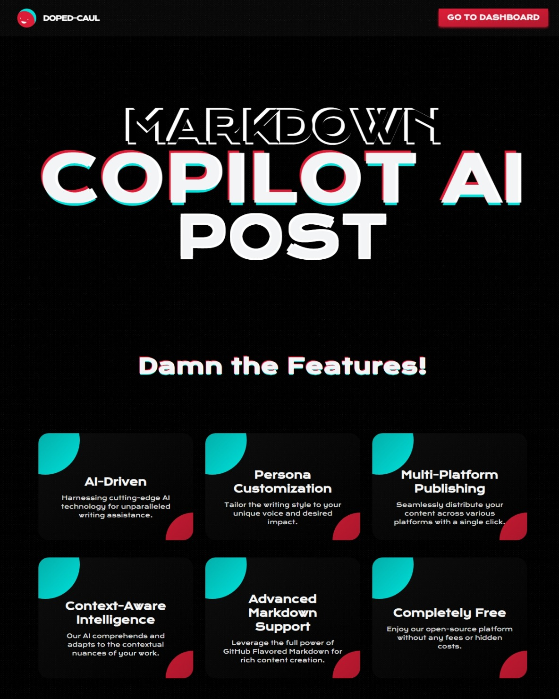

# 🖋️ Doped-Caul 🖋️

<p align="center">
<h2 align="center">Markdown -> AI -> Publish</h2>
<br />

</p>

> [!NOTE]
>
> Doped Caul" is a cutting-edge platform that combines the expertise of human writers with the capabilities of artificial intelligence. It allows technical writers to create and publish their articles efficiently, with the help of an AI assistant that can automatically enhance and complete your work. The platform boasts a user-friendly interface, a safe and secure environment with GitHub OAuth login, and a streamlined publishing process, eliminating the hassle of managing multiple platforms.

---

<p align="center">
<a href="todo">
|  |
|------------|
| 💀 React on my dev.to article written on this project! |
</a>
</p>

---

## ✨ Features

- **AI-Powered Writing Assistant** 🧠: Leverage the power of AI to enhance and streamline your writing process. Get real-time suggestions and assistance from advanced language models.

- **Seamless Integration with Popular Platforms** 🌐: Publish your AI-written articles directly to platforms like dev.to, Medium, and Hashnode with just a few clicks. No more hassle of managing multiple platforms.

- **Secure and User-Friendly Interface** 🔒💻: Enjoy a safe and secure environment with GitHub OAuth login. The intuitive UI ensures a smooth writing experience for technical writers.

- **Customizable Prompts** 🎨: Tailor the AI prompts to your specific needs, ensuring that the generated content aligns with your writing style and preferences.

- **Markdown Support** 📝: Write in Markdown format and get a live preview of your content rendered in HTML, making it easy to visualize the final output.

- **Responsive Design** 📱💻: Access and write from anywhere, with a mobile-friendly interface that adapts to various screen sizes.

- **Robust Backend** 🛠️: Built with Express.js and powered by OpenAI's GPT-3.5 model, ensuring reliable and high-quality AI-generated content.

## 💻 Tech Stack

**Frontend:**
- React
- Refine (React-based framework)
- UnoCSS (Utility-first CSS framework)
- CopilotKit (AI integration)

**Backend:**
- Node.js
- Express.js
- OpenAI API (GPT-3.5 model)

**Authentication and Database:**
- Supabase (Authentication and Database solution)

**Other Libraries and Tools:**
- marked (Markdown to HTML converter)
- React Memo (Performance optimization)
- GitHub OAuth (Secure authentication)

## 🖼️ Screenshots

> Here's a working and expected screenshot of Tila dashboard


| Landing Page  |
|------------|
|  |


| Dashboard  |
|------------|
|  |


| New Post |
|------------|
|  |


| Edit Post |
|------------|
|  |


| Publish Post |
|------------|
|  |

| Markdown Editor |
|------------|
|  |

| Supabase `posts` table fields |
|------------|
|  |


---

# 🚀 Configure these things

## ⚙️ Environment Variables and Configuration ⚒️

To run the project locally, you'll need to set up the following environment variables: 🔑

```bash
VITE_SECRET="<your secret word(s) to encode secret data>" 🔒
VITE_SUPABASE_URL="<your supabase project url>" 🌐
VITE_SUPABASE_KEY="<your supabase project key>" 🔑
OPENAI_KEY="<your openai api key>" 🤖
```

Additionally, you'll need to configure the frontend and backend URLs: 🌐

**Frontend:** 💻

In the root directory of your project, locate the `main.jsx` file (or the entry point of your React application). Inside this file, you'll find the `CopilotKit` component. Update the `url` and `runtimeUrl` props with your backend URL: 🔗

```jsx
<CopilotKit
  url="<your backend url>" 🔗
  runtimeUrl="<your backend url>" 🔗
>
  {/* ... */}
</CopilotKit>
```

**Backend:** 🖥️

In your backend code (e.g., Express.js server), you'll need to set up CORS (Cross-Origin Resource Sharing) to allow requests from your frontend origin. Update the `Access-Control-Allow-Origin` header with your frontend URL: 🌐

```javascript
app.use(function (req, res, next) {
  res.header("Access-Control-Allow-Origin", "<your frontend url>"); 🌐
  res.header(
    "Access-Control-Allow-Headers",
    "Origin, X-Requested-With, Content-Type, Accept"
  );
  next();
});
```

> Make sure to replace `<your frontend url>` and `<your backend url>` with the appropriate URLs for your local development environment. 🚀


> [!TIP]
> 
> By setting up the environment variables and configuring the frontend and backend URLs, you'll ensure that the application can communicate with the necessary services and APIs correctly. 

---

## 🤝 Contribution

> We welcome contributions to Tila Dashboard! If you'd like to contribute,
> please follow these steps:

1. Fork the repository.
2. Create a new branch for your feature / bug fix.
3. Make your changes & commit them.
4. Push your changes to your forked github repository.
5. Submit a PR to this GitHub repository.

---

## 🌟 Support the Project


<p align="center><strong>👋 We hope Tila Dashboard helps you effortlessly monitor and
manage your website's uptime, metrics, and incident history. Happy coding! </strong></p>

--- 
